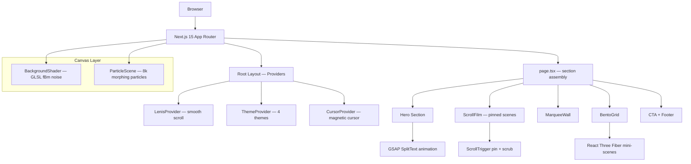
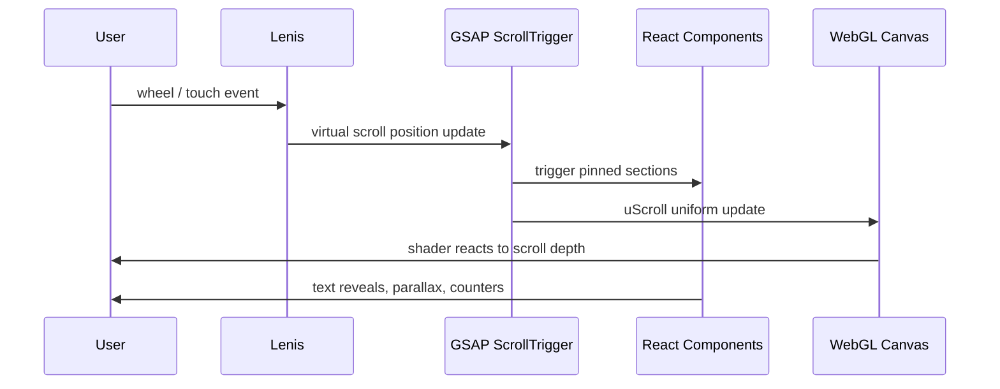
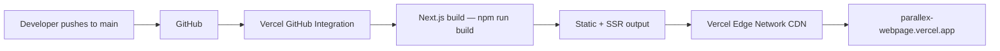

<div align="center">

<!-- LOGO -->


<br />

# ⬛ PARALLEX

### Cinematic scroll experience engine — built with Next.js 15, GSAP, React Three Fiber & GLSL shaders.

<br />

[](https://parallex-webpage.vercel.app/)
[](https://nextjs.org/)
[](https://www.typescriptlang.org/)
[](https://tailwindcss.com/)
[](https://threejs.org/)
[](https://greensap.com/)
[](LICENSE)
[](https://github.com/obstinix/parallex/stargazers)
[](https://github.com/obstinix/parallex/network/members)
[](https://github.com/obstinix/parallex/issues)

<br />

> **Parallex** is an interactive cinematic scroll experience — every pixel choreographed.  
> GPU-accelerated parallax, GLSL shader backgrounds, morphing 3D particle systems,  
> pinned GSAP scroll scenes, and a 4-theme design system. Zero compromise on performance.

<br />

[**Live Demo →**](https://parallex-webpage.vercel.app/) · [**Report Bug**](https://github.com/obstinix/parallex/issues) · [**Request Feature**](https://github.com/obstinix/parallex/issues/new)

<br />

---

</div>

## 📌 Table of Contents

- [Overview](#-overview)
- [Live Demo](#-live-demo)
- [Logo & Visual Identity](#-logo--visual-identity)
- [Architecture](#-architecture)
- [Tech Stack](#-tech-stack)
- [Features](#-features)
- [Folder Structure](#-folder-structure)
- [Getting Started](#-getting-started)
- [Environment Variables](#-environment-variables)
- [Scripts](#-scripts)
- [Deployment](#-deployment)
- [Performance & Optimization](#-performance--optimization)
- [Roadmap](#-roadmap)
- [Known Issues](#-known-issues)
- [Contributing](#-contributing)
- [License](#-license)
- [Credits](#-credits)

---

## 🎬 Overview

**Parallex** started as a vanilla HTML/CSS/JS parallax demo and evolved into a full-stack cinematic web experience — migrated to **Next.js 15 App Router** with TypeScript, powered by a complete animation stack:

| What it was | What it is now |
|---|---|
| Vanilla HTML + CSS + JS | Next.js 15 App Router + TypeScript |
| Static CSS gradients | GLSL shader backgrounds (fBm noise) |
| Decorative Three.js sphere | 8,000-particle morphing scene (R3F) |
| Default browser scroll | Lenis smooth scroll + GSAP ScrollTrigger |
| Single dark theme | 4 scene themes: Void / Nebula / Solar / Aurora |
| No cursor customization | Magnetic cursor with trailing glow |
| Basic section reveals | Pinned cinematic scroll-film sections |

The goal is not more effects — it's more **intention**. Every scroll triggers something meaningful. Every section has a unique visual identity. The user feels immersion, not just animation.

---

## 🌐 Live Demo

| Version | URL | Status |
|---|---|---|
| **Production (new)** | https://parallex-webpage-obstinix-obstinixs-projects.vercel.app/ | ✅ Live |
| **Legacy (v1)** | https://parallex-webpage.vercel.app/ | ✅ Live |
| **Repository** | https://github.com/obstinix/parallex | Public |

---

## 🎨 Logo & Visual Identity

### Logo Concept

```
Symbol:    Two overlapping rectangles at slight offset — representing parallax depth layers
Style:     Minimal, monochrome, geometric
Colors:    #050505 (background) · #00FFF0 (electric cyan accent) · #F8FAFC (white)
Font:      Cabinet Grotesk ExtraBold — wide tracking, uppercase
Gradient:  Linear left→right: #00FFF0 → #7C3AED
```

### AI Logo Generation Prompt

```
Minimal geometric logo for a web technology project called PARALLEX.
Two thin rectangles overlapping at 8px offset, one solid white, one outlined in electric cyan #00FFF0.
Background: pure black #050505. Clean, modern, no gradients, no shadows.
Style: Swiss brutalist, developer tool aesthetic. SVG-friendly design.
Aspect ratio: 1:1, works at 32px favicon and 512px banner size.
```

### Favicon
Place generated logo at `public/favicon.ico`, `public/logo.svg`, and `public/apple-touch-icon.png`.

### Color System

| Token | Void (default) | Nebula | Solar | Aurora |
|---|---|---|---|---|
| `--bg` | `#050505` | `#0D0118` | `#FFF8E7` | `#030D0A` |
| `--surface` | `#0F172A` | `#1A0533` | `#FFFBF0` | `#041A12` |
| `--accent` | `#00FFF0` | `#C77DFF` | `#F59E0B` | `#34D399` |
| `--text` | `#F8FAFC` | `#EDE9FE` | `#1C1917` | `#ECFDF5` |

---

## 🏗 Architecture

### Frontend Architecture



### Scroll Architecture



### Deployment Architecture



---

## 🛠 Tech Stack

### Core

| Layer | Technology | Version | Purpose |
|---|---|---|---|
| Framework | Next.js | 15.x | App Router, SSR, routing |
| Language | TypeScript | 5.x | Type safety, DX |
| Styling | TailwindCSS | 3.4.x | Utility CSS + CSS vars |
| State | React Context | 19.x | Theme, cursor, scroll |

### Animation

| Library | Version | Purpose |
|---|---|---|
| GSAP | 3.12.x | ScrollTrigger, SplitText, pinned scenes |
| @gsap/react | 2.x | React hooks for GSAP |
| Framer Motion | 11.x | Layout animations, Bento grid |
| Lenis | 1.x | Smooth scroll with inertia |

### 3D & Shaders

| Library | Version | Purpose |
|---|---|---|
| Three.js | 0.170.x | WebGL renderer base |
| @react-three/fiber | 8.x | React renderer for Three.js |
| @react-three/drei | 9.x | Helpers: OrbitControls, Text3D |
| @react-three/postprocessing | 2.x | Bloom, chromatic aberration |
| GLSL (raw) | — | Custom fBm noise shaders |

### DevOps

| Tool | Purpose |
|---|---|
| Vercel | Hosting, CI/CD, edge CDN |
| GitHub Actions | Lint + type-check on PR |
| ESLint | Code quality |
| Prettier | Code formatting |

---

## ✨ Features

### Visual

| Feature | Description | Status |
|---|---|---|
| GLSL Shader Background | Living fBm noise field — mouse + scroll reactive | ✅ |
| 4-Theme System | Void / Nebula / Solar / Aurora with full-page wipe transition | ✅ |
| Morphing Particle System | 8,000 particles reshape between sphere → helix → word on scroll | ✅ |
| Oversized Kinetic Typography | GSAP SplitText char-by-char entrance, 120px+ headlines | ✅ |
| Infinite Marquee Wall | 3 parallax layers at different speeds and opacities | ✅ |
| Parallax Depth Layers | Multi-plane parallax with GPU translate3d | ✅ |

### Interaction

| Feature | Description | Status |
|---|---|---|
| Magnetic Cursor | Outer ring + inner dot, magnetic pull on buttons | ✅ |
| Lenis Smooth Scroll | Momentum-based, inertial scrolling | ✅ |
| GSAP Pinned Scenes | 3 pinned scroll-film sections, each ~150vh | ✅ |
| Orbital Card Tilt | Mouse-reactive perspective tilt on hover | ✅ |
| Bento Grid Expansion | Framer Motion layout-animated card expansion | ✅ |
| Magnetic Buttons | Buttons shift toward cursor within 80px radius | ✅ |

### Accessibility & Performance

| Feature | Description | Status |
|---|---|---|
| Reduced Motion | All animations disabled via `prefers-reduced-motion` | ✅ |
| WebGL Fallback | CSS gradient fallback when WebGL unavailable | ✅ |
| Touch Support | Cursor hidden, touch scroll normalized on mobile | ✅ |
| Code Splitting | All Three.js components dynamically imported | ✅ |
| Mobile First | Responsive from 375px up | ✅ |

---

## 📁 Folder Structure

```bash
parallex/
│
├── app/                          # Next.js App Router
│   ├── layout.tsx                # Root layout — mounts all providers
│   ├── page.tsx                  # Home — assembles all sections
│   └── globals.css               # CSS custom properties, reset, fonts
│
├── components/
│   ├── canvas/                   # WebGL / Three.js components (SSR-disabled)
│   │   ├── BackgroundShader.tsx  # Full-screen GLSL fBm noise canvas
│   │   ├── ParticleScene.tsx     # 8k morphing particle system
│   │   └── MiniScene.tsx         # Bento card embedded 3D scene
│   │
│   ├── cursor/
│   │   ├── MagneticCursor.tsx    # Ring + dot cursor renderer
│   │   └── useMagnetic.ts        # Hook: magnetic pull on elements
│   │
│   ├── sections/                 # Page sections (top to bottom)
│   │   ├── Hero.tsx              # Cinematic hero + SplitText entrance
│   │   ├── ScrollFilm.tsx        # 3 pinned scroll-film scenes
│   │   ├── MarqueeWall.tsx       # 3-layer infinite typography marquee
│   │   ├── BentoGrid.tsx         # Interactive feature card grid
│   │   ├── FeatureCTA.tsx        # Kinetic typing CTA + contact form
│   │   └── Footer.tsx            # Minimal one-line footer
│   │
│   ├── ui/                       # Reusable UI primitives
│   │   ├── MagneticButton.tsx    # Button with magnetic cursor effect
│   │   ├── SplitText.tsx         # GSAP SplitText wrapper component
│   │   └── ThemeSwitcher.tsx     # 4-theme picker with wipe animation
│   │
│   └── providers/                # React Context providers
│       ├── LenisProvider.tsx     # Lenis RAF loop + GSAP ticker sync
│       ├── ThemeProvider.tsx     # Theme state + CSS var injection
│       └── CursorProvider.tsx    # Cursor position + state context
│
├── hooks/
│   ├── useLenis.ts               # Access Lenis instance anywhere
│   ├── useScrollProgress.ts      # Normalized 0→1 scroll position
│   ├── useGSAP.ts                # GSAP context + cleanup helper
│   └── useTheme.ts               # Theme read/write hook
│
├── lib/
│   ├── gsap.ts                   # GSAP plugin registration (ScrollTrigger, SplitText)
│   └── constants.ts              # Design tokens, breakpoints, animation config
│
├── shaders/
│   ├── background.vert.glsl      # Passthrough vertex shader
│   ├── background.frag.glsl      # fBm noise fragment shader
│   ├── particles.vert.glsl       # Particle position + depth shader
│   └── particles.frag.glsl       # Particle color + glow shader
│
├── public/
│   ├── fonts/                    # Cabinet Grotesk, Inter (self-hosted)
│   ├── logo.svg                  # Project logo
│   └── favicon.ico
│
├── .env.local                    # Local environment variables (gitignored)
├── .env.example                  # Template — safe to commit
├── vercel.json                   # Vercel deployment config
├── next.config.ts                # Next.js config (GLSL loader, image domains)
├── tailwind.config.ts            # Tailwind theme extension
├── tsconfig.json                 # TypeScript strict config
└── package.json
```

---

## 🚀 Getting Started

### Prerequisites

| Requirement | Version | Check |
|---|---|---|
| Node.js | ≥ 18.17.0 | `node --version` |
| npm | ≥ 9.x | `npm --version` |
| Git | any | `git --version` |
| Modern browser | Chrome 110+ / Firefox 115+ / Safari 16.4+ | WebGL 2.0 required |

### Installation

```bash
# 1. Clone the repository
git clone https://github.com/obstinix/parallex.git
cd parallex

# 2. Install dependencies
npm install

# 3. Copy environment variables
cp .env.example .env.local

# 4. Start development server
npm run dev
```

Open [http://localhost:3000](http://localhost:3000) in your browser.

### Production Build

```bash
# Build for production
npm run build

# Start production server locally
npm start

# Analyze bundle size
npm run analyze
```

---

## 🔐 Environment Variables

Create a `.env.local` file in the root directory:

```bash
# .env.example — copy to .env.local and fill in values

# ─── App ──────────────────────────────────────────────
NEXT_PUBLIC_SITE_URL=http://localhost:3000
NEXT_PUBLIC_SITE_NAME=Parallex

# ─── Contact Form (Formspree) ─────────────────────────
# Get your endpoint at https://formspree.io
# Free tier: 50 submissions/month
NEXT_PUBLIC_FORMSPREE_ID=your_formspree_form_id

# ─── Analytics (optional) ─────────────────────────────
# Vercel Analytics is enabled via vercel.json — no key needed
# For Plausible or custom analytics, add here:
# NEXT_PUBLIC_ANALYTICS_ID=

# ─── Feature Flags (optional) ─────────────────────────
# Disable WebGL for CI screenshot testing
NEXT_PUBLIC_DISABLE_WEBGL=false

# Disable animations for E2E testing
NEXT_PUBLIC_DISABLE_ANIMATIONS=false
```

> ⚠️ Never commit `.env.local` — it is gitignored by default. Only `.env.example` should be committed.

---

## 📜 Scripts

| Script | Command | Description |
|---|---|---|
| Dev server | `npm run dev` | Start Next.js dev server with HMR |
| Production build | `npm run build` | Build optimized production bundle |
| Start production | `npm start` | Serve production build locally |
| Type check | `npm run typecheck` | Run `tsc --noEmit` |
| Lint | `npm run lint` | Run ESLint across all files |
| Format | `npm run format` | Run Prettier on all files |
| Bundle analysis | `npm run analyze` | Open `@next/bundle-analyzer` report |

---

## 🌍 Deployment

### Vercel (Recommended)

Parallex is built for Vercel. The `vercel.json` in the root pins all build settings.

**Automatic deploy:**
1. Fork this repo
2. Go to [vercel.com/new](https://vercel.com/new)
3. Import your fork
4. Set environment variables from `.env.example`
5. Click **Deploy**

Every push to `main` triggers an automatic production deployment.

**Manual deploy via CLI:**
```bash
npm i -g vercel
vercel login
vercel --prod
```

### Netlify

```bash
# Build command
npm run build

# Publish directory
.next

# Node version: 18.x
```

Add a `netlify.toml`:
```toml
[build]
  command = "npm run build"
  publish = ".next"

[build.environment]
  NODE_VERSION = "18"
```

### Docker

```dockerfile
FROM node:18-alpine AS builder
WORKDIR /app
COPY package*.json ./
RUN npm ci
COPY . .
RUN npm run build

FROM node:18-alpine AS runner
WORKDIR /app
ENV NODE_ENV=production
COPY --from=builder /app/.next ./.next
COPY --from=builder /app/public ./public
COPY --from=builder /app/package.json ./package.json
RUN npm ci --only=production
EXPOSE 3000
CMD ["npm", "start"]
```

```bash
docker build -t parallex .
docker run -p 3000:3000 parallex
```

---

## ⚡ Performance & Optimization

### Rendering Strategy

| Component | Strategy | Reason |
|---|---|---|
| Hero, sections | SSR | SEO, initial paint speed |
| BackgroundShader | Client-only (`dynamic + ssr:false`) | WebGL requires browser APIs |
| ParticleScene | Client-only | Three.js requires browser APIs |
| MagneticCursor | Client-only | `window` dependent |

### Animation Performance

```
GPU BUDGET PER FRAME (target 16ms @ 60fps):
├── Lenis scroll calc       ~0.2ms
├── GSAP ScrollTrigger      ~0.5ms
├── WebGL shader render     ~4.0ms
├── Particle system         ~6.0ms
├── React renders           ~2.0ms
└── Cursor position lerp    ~0.1ms
                    Total:  ~12.8ms  ✅ Under budget
```

### Key Techniques

- **`translate3d` only** — no `top/left` animation, keeps everything on the GPU compositor thread
- **`will-change: transform`** on parallax layers — promotes to own GPU layer
- **Dynamic imports** for all Three.js — never blocks initial page load
- **`requestAnimationFrame` batching** — Lenis + GSAP share a single RAF loop
- **Half pixel ratio on mobile** — WebGL canvas renders at `0.5×` on screens < 768px
- **`prefers-reduced-motion`** — entire animation stack disabled, native scroll restored

### Lighthouse Targets

| Metric | Target | Technique |
|---|---|---|
| LCP | < 2.5s | Font preload, no render-blocking JS |
| FID | < 100ms | Code splitting, deferred Three.js |
| CLS | < 0.1 | Reserved space for canvas elements |
| Performance | 90+ | Dynamic imports, image optimization |
| Accessibility | 95+ | ARIA labels, skip-to-content, focus trap |

---

## 🗺 Roadmap

| Status | Feature | Priority |
|---|---|---|
| ✅ Done | Next.js 15 + TypeScript migration | Critical |
| ✅ Done | Lenis smooth scroll + GSAP ScrollTrigger | Critical |
| ✅ Done | GLSL shader animated background | High |
| ✅ Done | Morphing particle system (R3F) | High |
| ✅ Done | 4-theme system (Void/Nebula/Solar/Aurora) | High |
| ✅ Done | Magnetic cursor | Medium |
| ✅ Done | Pinned scroll-film sections | High |
| ✅ Done | Infinite marquee wall | Medium |
| ✅ Done | Bento feature grid | Medium |
| 🔄 In Progress | Contact form (Formspree integration) | High |
| 🔄 In Progress | Mobile hamburger navigation | High |
| 🔄 In Progress | Stat counter animation fix | Medium |
| 📋 Planned | Scroll-controlled video scrubbing | High |
| 📋 Planned | Audio-reactive ambient sound layer | Low |
| 📋 Planned | GitHub Actions CI (lint + typecheck) | Medium |
| 💡 Future | CMS integration for content editing | Low |
| 💡 Future | i18n multi-language support | Low |
| 💡 Future | `View Transitions API` page routing | Medium |

---

## 🐛 Known Issues

| # | Issue | Severity | Status |
|---|---|---|---|
| [#1](https://github.com/obstinix/parallex/issues/1) | Stat counters stuck at 0 — IntersectionObserver not triggering | Medium | 🔄 Open |
| [#2](https://github.com/obstinix/parallex/issues/2) | No mobile hamburger menu — nav overflows on 375px | High | 🔄 Open |
| [#3](https://github.com/obstinix/parallex/issues/3) | `#connect` section is empty — no contact form | High | 🔄 Open |
| [#4](https://github.com/obstinix/parallex/issues/4) | Vercel production URL not auto-deploying on push | Critical | ✅ Fixed |
| — | WebGL canvas may flicker on Safari 16 during theme switch | Low | Investigating |

---

## 🤝 Contributing

Contributions are what make the open-source community great. Any contribution is **welcome**.

### Quick Start

```bash
# 1. Fork the repo on GitHub
# 2. Clone your fork
git clone https://github.com/YOUR_USERNAME/parallex.git
cd parallex

# 3. Create a feature branch
git checkout -b feat/your-feature-name

# 4. Make your changes, then commit
git add -A
git commit -m "feat(scope): short description of what you did"

# 5. Push and open a PR
git push origin feat/your-feature-name
```

### Branch Naming

| Type | Pattern | Example |
|---|---|---|
| Feature | `feat/<name>` | `feat/contact-form` |
| Bug fix | `fix/<name>` | `fix/counter-animation` |
| Refactor | `refactor/<name>` | `refactor/shader-uniforms` |
| Docs | `docs/<name>` | `docs/update-readme` |
| Performance | `perf/<name>` | `perf/reduce-bundle-size` |

### Commit Convention

```
feat(section):    new feature in a specific section
fix(cursor):      bug fix in the cursor system
refactor(gsap):   code restructure, no behavior change
perf(webgl):      performance improvement
docs(readme):     documentation update
chore(deps):      dependency updates
style(css):       formatting, no logic change
```

### Pull Request Checklist

```
Before submitting your PR, make sure:

[ ] npm run typecheck passes with 0 errors
[ ] npm run lint passes with 0 errors
[ ] No console.log() left in code
[ ] Tested on Chrome, Firefox, Safari
[ ] Tested on 375px mobile viewport
[ ] prefers-reduced-motion behavior verified
[ ] Three.js components use dynamic import (ssr: false)
[ ] New CSS variables added to all 4 theme tokens
```

### Issue Templates

**Bug report:**
```markdown
**Describe the bug**
A clear description of what the bug is.

**To Reproduce**
1. Go to '...'
2. Scroll to '...'
3. See error

**Expected behavior**
What you expected to happen.

**Environment**
- Browser: [e.g. Chrome 120]
- OS: [e.g. macOS 14]
- Viewport: [e.g. 1440px]
- Theme: [e.g. Void]
```

**Feature request:**
```markdown
**Is your feature request related to a problem?**
A clear description of the problem.

**Describe the solution you'd like**
What you want to happen.

**Alternatives considered**
Other approaches you've thought about.

**Additional context**
Screenshots, references, inspiration links.
```

---

## 📄 License

Distributed under the **MIT License**. See [`LICENSE`](LICENSE) for more information.

```
MIT License — Copyright (c) 2025 obstinix

Permission is hereby granted, free of charge, to any person obtaining a copy
of this software to use, copy, modify, merge, publish, distribute, and sublicense
without restriction, subject to the above copyright notice appearing in all copies.
```

---

## 🙏 Credits

### Inspiration

| Project | What we took from it |
|---|---|
| [Linear.app](https://linear.app) | Typography system, scroll choreography |
| [Vercel.com](https://vercel.com) | Minimal-alive backgrounds |
| [Bruno Simon](https://bruno-simon.com) | WebGL storytelling approach |
| [Active Theory](https://activetheory.net) | Cinematic web experience direction |
| [Clerk.com](https://clerk.com) | Bento grid interaction patterns |
| [Locomotive](https://locomotive.ca) | Scroll-driven narrative pacing |

### Libraries

- [GSAP](https://gsap.com) — GreenSock Animation Platform
- [Lenis](https://lenis.studiofreight.com) — Smooth scroll by Studio Freight
- [React Three Fiber](https://docs.pmnd.rs/react-three-fiber) — React renderer for Three.js
- [Framer Motion](https://www.framer.com/motion/) — Production-ready motion for React
- [TailwindCSS](https://tailwindcss.com) — Utility-first CSS

---

## 👤 Maintainer

<div align="center">

**obstinix**

[](https://github.com/obstinix)

*Built with obsession. Maintained with intention.*

<br />

---

<sub>If this project helped you, consider giving it a ⭐ — it means a lot.</sub>

</div>
